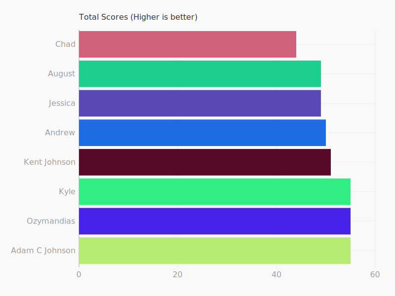
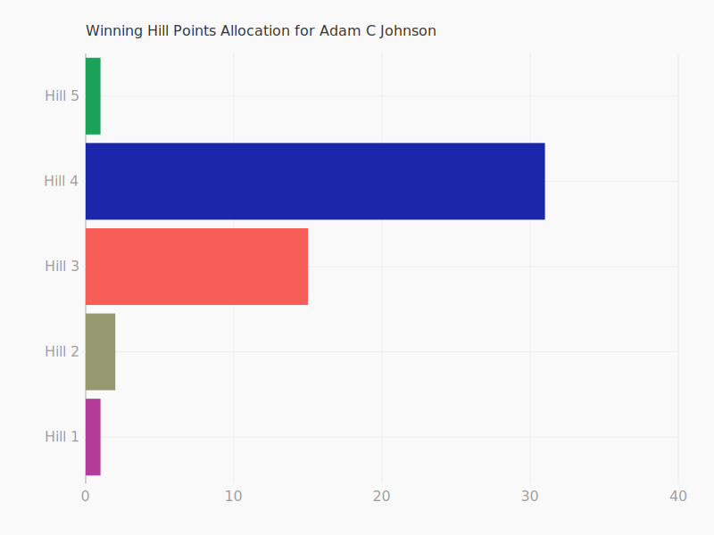
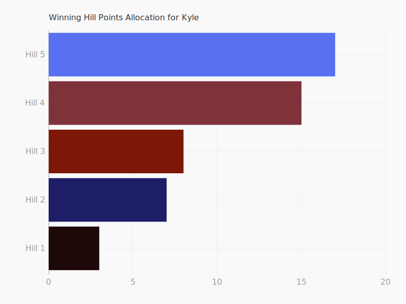
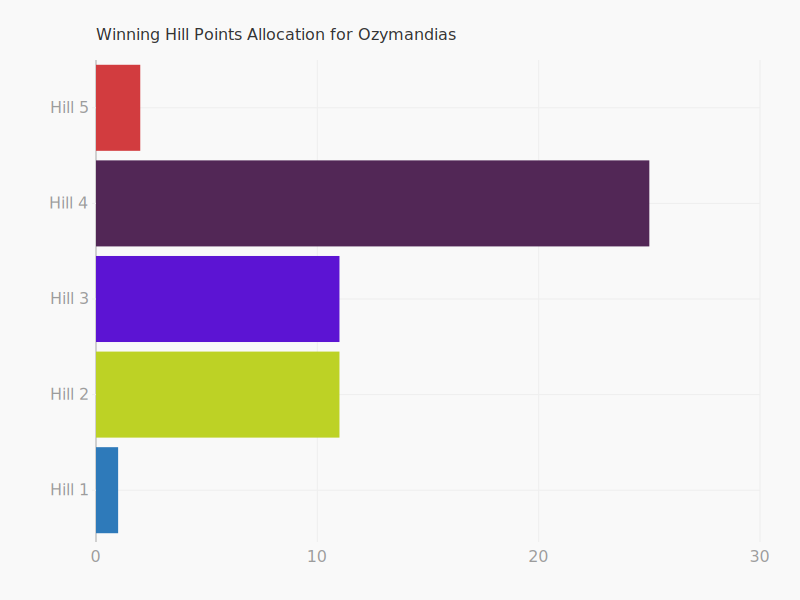

### Results
First some housekeeping.  I had to edit the code a bunch because I totally messed up some indexes, and it resulted in entire hills not even being counted.  Feel free to review the changes, the version that I have checked in includes all current logic, including analytics (to generate these beautiful charts below).

### Winner(s)!
We had a 3 way tie for first place.  The following individuals scored a total of 55 points.




The winners had a 3 way tie, each with 55 points.
* Adam C Johnson
* Kyle
* Ozymandias

The strategies are varied, even among the winners. Adam and Ozymandias both went all in on Hill 4, scoring some serious points, but Kyle seemed to play just enough in all hills to significantly take home some hill points, enough to tie with the others.


  


### Results Detail (log)
Total results output is here:
```
There are 8 entrants.
Running 28 matchups.
August vs Kyle: August gained 9, and Kyle gained 6
August vs Kent Johnson: August gained 5, and Kent Johnson gained 10
August vs Ozymandias: August gained 5, and Ozymandias gained 9
August vs Jessica: August gained 9, and Jessica gained 6
August vs Chad: August gained 6, and Chad gained 8
August vs Andrew: August gained 10, and Andrew gained 4
August vs Adam C Johnson: August gained 5, and Adam C Johnson gained 9
Kyle vs Kent Johnson: Kyle gained 8, and Kent Johnson gained 7
Kyle vs Ozymandias: Kyle gained 6, and Ozymandias gained 9
Kyle vs Jessica: Kyle gained 10, and Jessica gained 5
Kyle vs Chad: Kyle gained 8, and Chad gained 6
Kyle vs Andrew: Kyle gained 9, and Andrew gained 5
Kyle vs Adam C Johnson: Kyle gained 8, and Adam C Johnson gained 7
Kent Johnson vs Ozymandias: Kent Johnson gained 8, and Ozymandias gained 7
Kent Johnson vs Jessica: Kent Johnson gained 5, and Jessica gained 9
Kent Johnson vs Chad: Kent Johnson gained 9, and Chad gained 5
Kent Johnson vs Andrew: Kent Johnson gained 7, and Andrew gained 8
Kent Johnson vs Adam C Johnson: Kent Johnson gained 5, and Adam C Johnson gained 9
Ozymandias vs Jessica: Ozymandias gained 6, and Jessica gained 9
Ozymandias vs Chad: Ozymandias gained 8, and Chad gained 7
Ozymandias vs Andrew: Ozymandias gained 9, and Andrew gained 6
Ozymandias vs Adam C Johnson: Ozymandias gained 7, and Adam C Johnson gained 7
Jessica vs Chad: Jessica gained 9, and Chad gained 6
Jessica vs Andrew: Jessica gained 3, and Andrew gained 12
Jessica vs Adam C Johnson: Jessica gained 8, and Adam C Johnson gained 7
Chad vs Andrew: Chad gained 7, and Andrew gained 7
Chad vs Adam C Johnson: Chad gained 5, and Adam C Johnson gained 9
Andrew vs Adam C Johnson: Andrew gained 8, and Adam C Johnson gained 7
Final Scores
August: 49
Kyle: 55
Kent Johnson: 51
Ozymandias: 55
Jessica: 49
Chad: 44
Andrew: 50
Adam C Johnson: 55
```
